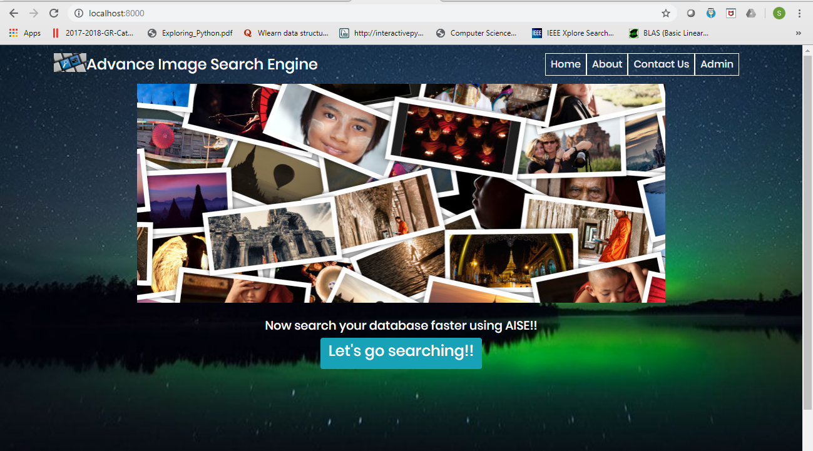
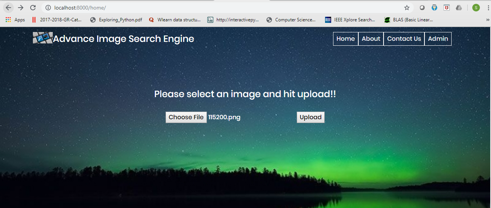
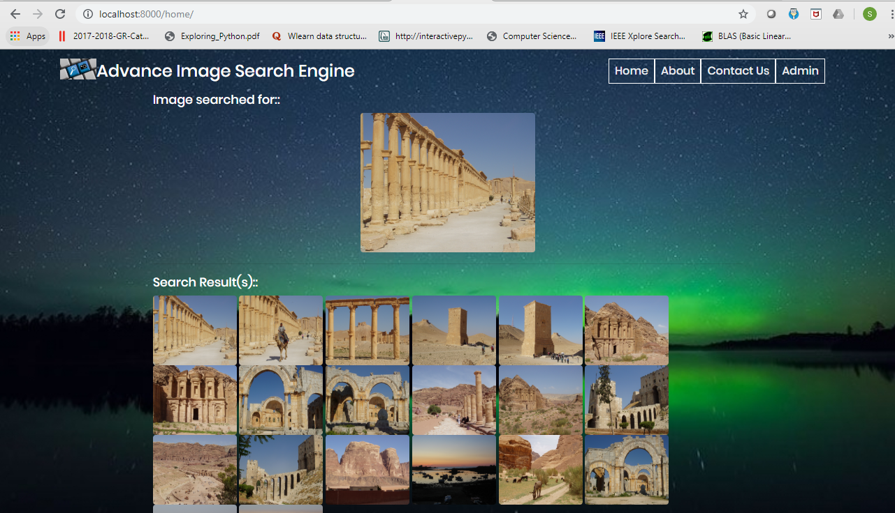

# Advanced-Image-Search-Engine
AISE is a Reverse Image Search Engine, where a user can upload sample image to the website and get top 18 images as results.

In Home page, once the user clicks on "Let's go searching", it redirects to search page.
In search page, user has to upload the sample input image. 
As a reuslt, top 18 related images will appear on the screen.

#### Technologies used:

* Python
* Django framework
* OpenCV
* pickle
* HTML, CSS, Bootstrap

#### Sample output pages:

##### HOME page:

##### Search page:

##### Result page:

#### TODO:
* Django ORM to store images to the Database
